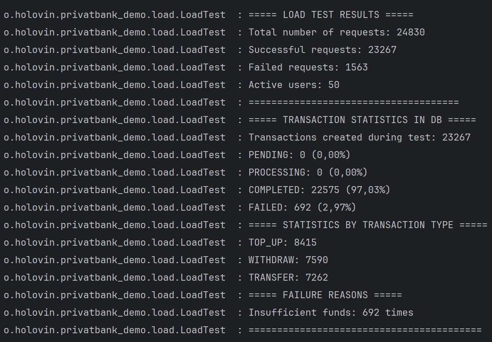

## Кроки реалізації

>
🔐 [Postman endpoints](https://web.postman.co/workspace/My-Workspace~84a0f1d6-61de-499b-888a-2d6f625b5968/collection/39735932-c585dbf7-66e8-42f0-ae35-ecaf19082693?action=share&source=copy-link&creator=39735932)

### 1. Аналіз предметної області

Першим кроком було вивчення, як зазвичай організовується архітектура міні-онлайн банку, та визначення основних сутностей
і їхніх атрибутів. Це дало змогу зрозуміти, які саме дані необхідно зберігати та як вони мають взаємодіяти між собою.

### 2. Проєктування бази даних

Далі я створив драфт архітектури бази даних. Продумав структуру, зв’язки між таблицями та обґрунтував поділ сутностей (
наприклад, `current_balance` та `account` як окремі об’єкти). Це забезпечило гнучкість та прозорість роботи з даними.

### 3. Реалізація обробників транзакцій

Наступним кроком було створення механізму обробки транзакцій — ключового елементу системи. Обробники запускаються під
час старту застосунку, беруть у роботу транзакції зі статусом *Pending* та працюють з ними паралельно, розподіляючи
задачі між різними воркерами.

### 4. Логіка обробки транзакцій

Для кожної транзакції перевіряється її тип (поповнення, списання, переказ) та валідність (наприклад, перевірка наявності
достатніх коштів). Також враховано, що транзакції можуть виконуватися не в порядку створення. Якщо умови виконання не
дотримуються — транзакція відхиляється.

### 5. API для користувачів

Створені контролери та сервіси для базових операцій: поповнення рахунку, зняття коштів та переказу.

### 6. Снепшоти балансу

Додано низькорівневий функціонал для створення щоденних снепшотів балансу без додаткового навантаження на застосунок. За
замовчуванням вони генеруються планувальником раз на добу о 00:00.

### 7. Ідемпотентність транзакцій

Реалізовано механізм із використанням UUID. Якщо транзакція з однаковими параметрами вже існує — система повертає
попередній результат. Це запобігає дублюванню операцій.

### 8. Навантажувальне тестування

Було проведено Load Test: симуляція роботи великої кількості користувачів, які виконують операції поповнення, зняття та
переказів. Частина запитів свідомо завершувалася помилкою (через брак коштів), інші ставали в чергу транзакцій і
оброблялися паралельно.

### 9. Методи для роботи з історією транзакцій

Реалізовані додаткові *GET*-методи для отримання інформації по транзакціях.

### 10. Оптимізація продуктивності

Додані індекси для найбільш використовуваних операцій, що покращило ефективність запитів при зростанні обсягів даних.

### 11. Доопрацювання архітектури

На завершальному етапі я додав InPort та OutPort у стилі DDD та гексагональної архітектури, щоб зробити систему більш
гнучкою й зручною для подальшої підтримки та розширення.

### 12. Доопрацювання чистоти коду

На цьому етапі я провів рефактор коду.
